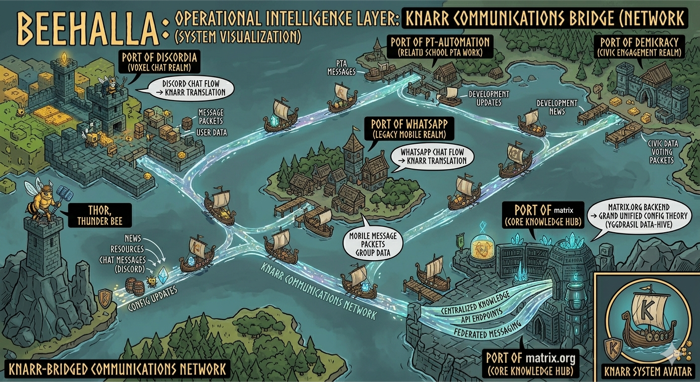

# Knarr



Integration/bridging layer for the Yggdrasil ecosystem. Self-hosted Matrix
homeserver with bridges, Kafka event bus, and platform watchers.

The metaphor: Knarr is the merchant ship and its trade routes — carrying messages
between platform ports, knowing the routes (routing rules), and keeping a manifest
(Kafka event log). Autoboros is the crew — chatbots and content adaptation.

## Documentation

| Doc | Description |
|-----|-------------|
| [Architecture](docs/architecture.md) | Two-plane design (Matrix + Kafka), data flows, testing strategies |
| [CLI Usage](docs/cli-usage.md) | Operational CLI and Python library for room/user/bridge management |
| [Discord Bridge Setup](docs/discord-bridge-setup.md) | mautrix-discord setup, identity mapping, troubleshooting |
| [Tailscale Setup](docs/tailscale-setup.md) | Remote access via Tailscale Serve for phone/off-LAN |
| Design Spec | Full design in the yggdrasil workspace: `docs/plans/2026-04-02-knarr-design.md` |

## Architecture

```
Reddit/GitHub/etc → Watchers → Kafka → Router Bot → Matrix (#social-watch)
Discord ←→ mautrix-discord ←→ Synapse ←→ Element (phone/desktop)
WhatsApp ←→ mautrix-whatsapp ←→ Synapse    (Phase 2)
```

**Layer 1 — Nervous System:** Synapse homeserver + mautrix bridges (transparent chat bridging)
**Layer 2 — Routing:** Kafka event bus + router service (curated fan-out, approval workflows)
**Layer 3 — Agents:** Platform watchers + Autoboros bots (monitoring, content adaptation)

## Components

| Component | Image | What it does |
|-----------|-------|-------------|
| Synapse | `matrixdotorg/synapse:v1.122.0` | Matrix homeserver, backed by PostgreSQL via Mimir |
| Router Bot | `knarr-router:dev` | Consumes Kafka alerts, posts to Matrix rooms |
| Watchers | `knarr-watchers:dev` | Polls Reddit/GitHub, publishes to Kafka |
| mautrix-discord | *(not yet deployed)* | Bridges Discord ↔ Matrix |
| Kafka UI | `provectuslabs/kafka-ui:v0.7.2` | Web dashboard for browsing topics/messages |
| Config Reconciler | Python (built-in) | Reads YAML config, diffs against Matrix state, applies changes |

## Prerequisites

- `k3d-nordri-test` cluster running (or equivalent k3s/k8s)
- Crossplane compositions: `xpostgresql-percona`, `xkafkacluster-strimzi`
- Strimzi operator in `kafka` namespace, Percona PG operator in `percona` namespace
- `/etc/hosts` entries: `192.168.97.2 matrix.knarr.local kafka-ui.knarr.local` (adjust IP for your Traefik LB)

## Deploy from Scratch

```bash
# 1. Namespace
kubectl apply -f k8s/namespace.yaml

# 2. PostgreSQL (takes ~3 min)
kubectl apply -f k8s/postgres-claim.yaml
kubectl get postgresqlinstance synapse-db -n knarr -w   # wait for READY=True

# 3. Synapse signing key (one-time)
python3 -c "
import base64, os
key = os.urandom(32)
kid = 'a_' + base64.b64encode(os.urandom(3)).decode().rstrip('=')
print(f'ed25519 {kid} {base64.b64encode(key).decode()}')
" > /tmp/signing.key
kubectl create secret generic synapse-signing-key -n knarr --from-file=signing.key=/tmp/signing.key
rm /tmp/signing.key

# 4. Update k8s/synapse/configmap.yaml with DB credentials from:
kubectl get secret synapse-db-user-secret -n knarr -o jsonpath='{.data.host}' | base64 -d
kubectl get secret synapse-db-user-secret -n knarr -o jsonpath='{.data.password}' | base64 -d

# 5. Synapse
kubectl apply -f k8s/synapse/
# Wait for health: curl http://matrix.knarr.local/health → "OK"

# 6. Create admin user
kubectl exec -n knarr deploy/synapse -- register_new_matrix_user \
  -c /config/homeserver.yaml -u admin -p <password> -a http://localhost:8008

# 7. Kafka (takes ~3 min)
kubectl apply -f k8s/kafka-claim.yaml
kubectl get kafkacluster knarr-kafka -n knarr -w   # wait for READY=True
# Update strimzi.io/cluster label in kafka-topics.yaml to match actual cluster name:
kubectl get kafka -n kafka   # note the NAME
kubectl apply -f k8s/kafka-topics.yaml

# 8. Build and load images
docker build -f src/watchers/Dockerfile -t knarr-watchers:dev .
docker build -f src/router/Dockerfile -t knarr-router:dev .
k3d image import knarr-watchers:dev knarr-router:dev -c nordri-test

# 9. Create router bot user
kubectl exec -n knarr deploy/synapse -- register_new_matrix_user \
  -c /config/homeserver.yaml -u knarr-router -p <password> --no-admin http://localhost:8008

# 10. Update k8s/router/deployment.yaml with room ID and credentials, then:
kubectl apply -f k8s/watchers/
kubectl apply -f k8s/router/

# 11. Kafka UI (optional but recommended)
kubectl apply -f k8s/kafka-ui/
# Open http://kafka-ui.knarr.local (needs /etc/hosts entry)
```

## Operations

### Checking Status

```bash
# All Knarr pods
kubectl get pods -n knarr

# Watcher logs (Reddit polling, GitHub errors if no token)
kubectl logs -n knarr -l app=knarr-watchers --tail=20

# Router logs (Kafka consumption, Matrix posting)
kubectl logs -n knarr -l app=knarr-router --tail=20

# Synapse logs
kubectl logs -n knarr -l app=synapse --tail=20
```

### Kafka UI (Web Dashboard)

The easiest way to inspect Kafka. Requires `/etc/hosts` entry:
`192.168.97.2 kafka-ui.knarr.local` (same IP as Matrix).

```bash
# Deploy (one-time)
kubectl apply -f k8s/kafka-ui/

# Then open in browser
open http://kafka-ui.knarr.local
```

From the UI you can:
- **Topics** → click `knarr.watch.alerts` → **Messages** tab to browse all events with formatted JSON
- **Topics** → any topic → **Produce Message** to send a test event
- **Consumers** → `knarr-router` group to check offset lag (is the router keeping up?)
- **Dashboard** for cluster overview

### Kafka CLI (kcat)

For scripting or quick terminal checks, `kcat` talks directly to Kafka via port-forward:

```bash
brew install kcat

# Port-forward Kafka (background, keep open while using kcat)
kubectl port-forward -n kafka svc/knarr-kafka-8r9tn-kafka-bootstrap 9092:9092 &

# List topics
kcat -b localhost:9092 -L

# Read all messages from watch.alerts, formatted
kcat -b localhost:9092 -t knarr.watch.alerts -C -e -J | python3 -m json.tool

# Read just the last 3 messages
kcat -b localhost:9092 -t knarr.watch.alerts -C -o -3 -e

# Publish a test alert
echo '{"event_id":"test","timestamp":"2026-04-05T00:00:00Z","source":{"platform":"test","channel":"manual","community":"terasology"},"content":{"type":"test","body":"Manual test alert","url":null}}' | \
  kcat -b localhost:9092 -t knarr.watch.alerts -P

# Kill the port-forward when done
kill %1
```

### Kafka via kubectl (fallback)

```bash
# List all Knarr topics
kubectl get kafkatopics -n kafka | grep knarr

# Check router consumer group lag
kubectl exec -n kafka knarr-kafka-8r9tn-knarr-kafka-8r9tn-combined-0 -- \
  bin/kafka-consumer-groups.sh --bootstrap-server localhost:9092 \
  --describe --group knarr-router
```

### Matrix Client Access

**Element Desktop (Mac):**
```bash
brew install --cask element
```
Sign in → custom homeserver `http://matrix.knarr.local` → `admin` / your password.

**Element Mobile (phone):**
Requires Tailscale or other network path to reach the k3d cluster.
Use the Tailscale IP of the Mac instead of `matrix.knarr.local`.

### Rebuilding After Code Changes

```bash
docker build -f src/watchers/Dockerfile -t knarr-watchers:dev .
docker build -f src/router/Dockerfile -t knarr-router:dev .
k3d image import knarr-watchers:dev knarr-router:dev -c nordri-test
kubectl rollout restart deploy/knarr-watchers deploy/knarr-router -n knarr
```

### Configuration

| Env Var | Default | Used by | Description |
|---------|---------|---------|-------------|
| `POLL_INTERVAL_SECONDS` | 21600 (6h) | Watchers | How often to poll Reddit/GitHub |
| `REDDIT_SUBREDDIT` | Terasology | Watchers | Subreddit to watch |
| `GITHUB_REPOS` | MovingBlocks/Terasology | Watchers | Comma-separated repo list |
| `GITHUB_TOKEN` | *(none)* | Watchers | PAT for GitHub notifications API |
| `KAFKA_BOOTSTRAP` | *(required)* | Both | Kafka bootstrap servers |
| `MATRIX_HOMESERVER` | *(required)* | Router | Synapse URL |
| `MATRIX_ROOM_ID` | *(required)* | Router | Target room for alerts |

## Testing

```bash
python3 -m pytest tests/ -v
```

76 unit tests covering event schemas, Reddit/GitHub watcher parsing and
deduplication, router message formatting, Matrix admin client operations,
Discord bridge manager command sequencing, config schema validation
(including malformed-shape rejection), and reconciler diff/apply logic.
BDD integration scenarios for the config reconciler live under
`tests/features/` (run against a real homeserver when
`KNARR_ADMIN_PASSWORD` is set; otherwise skip).

Lint with `python3 -m ruff check src/ tests/` (install via the `dev` extras).

## Kafka Topics

| Topic | Purpose |
|-------|---------|
| `knarr.messages.inbound` | Messages arriving from bridges |
| `knarr.messages.outbound` | Messages approved for publishing |
| `knarr.watch.alerts` | Platform watcher alerts |
| `knarr.routing.pending` | Awaiting human approval |
| `knarr.routing.decisions` | Approval/rejection events |
| `knarr.content.draft` | Content being shaped before publishing |

## Known Issues

- **Synapse locale:** Percona creates databases with `en_US.utf-8` collation.
  Synapse wants `C`. Workaround: `allow_unsafe_locale: true` in homeserver.yaml
  database config.
- **GitHub watcher 401:** Requires a personal access token with `notifications:read`
  scope. Without it, the watcher logs errors every poll cycle but continues running.
- **Kafka cluster name:** The Crossplane composition generates a random suffix
  (e.g. `knarr-kafka-8r9tn`). The `strimzi.io/cluster` label in `kafka-topics.yaml`
  must match. Check with `kubectl get kafka -n kafka`.
