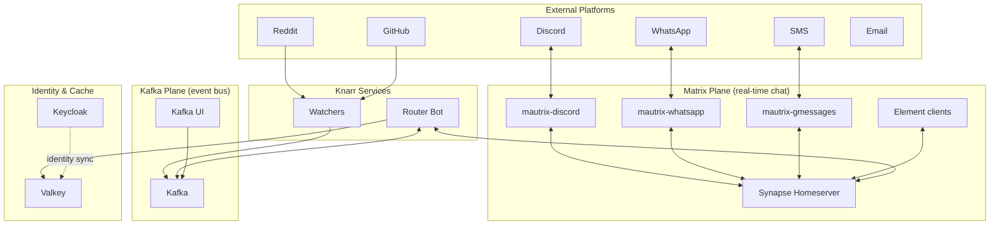
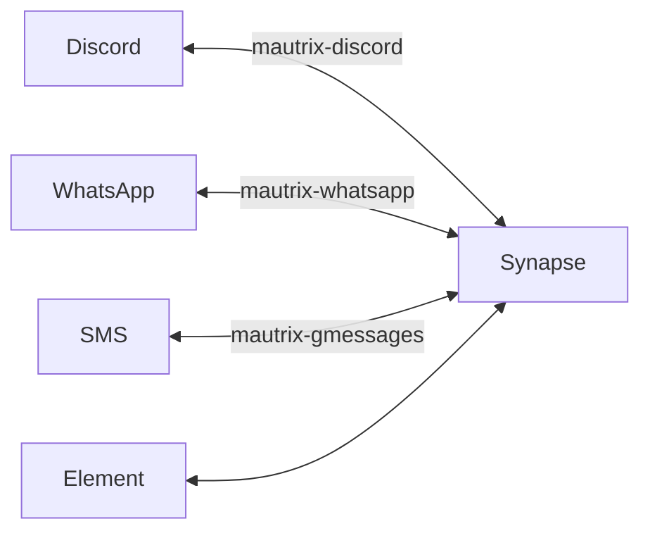
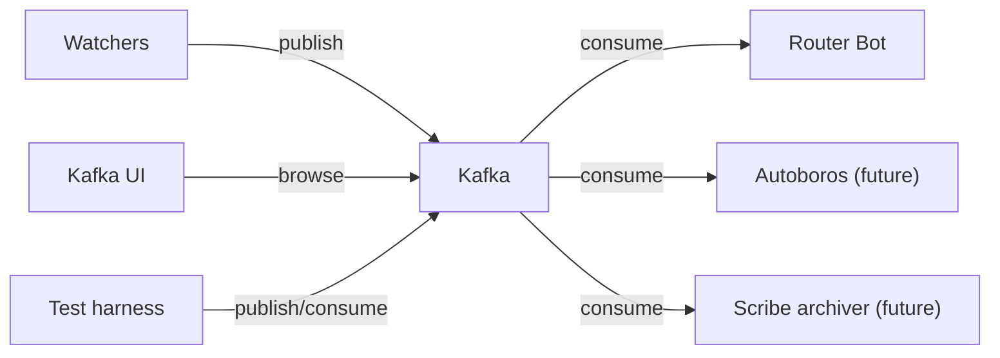
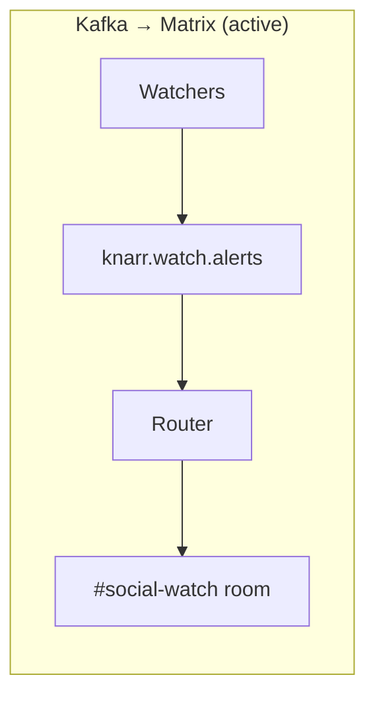
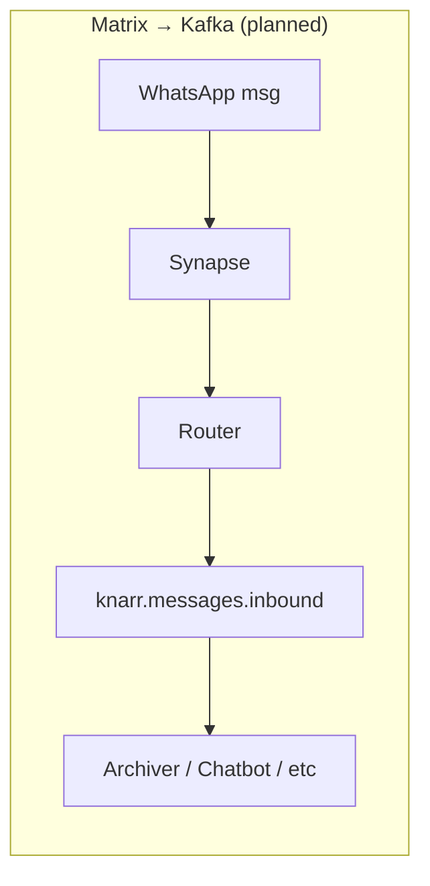
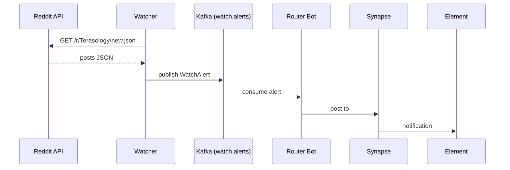
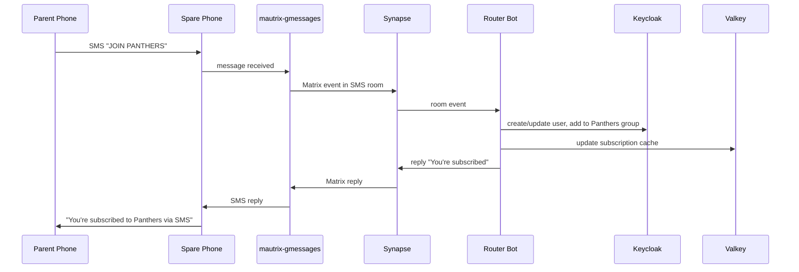
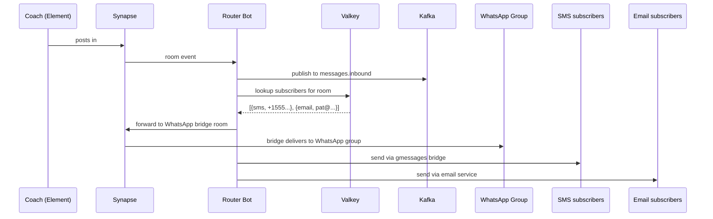

# Knarr Architecture

## The Big Picture

Knarr has two independent data planes: **Matrix** (real-time chat bridging) and
**Kafka** (event bus for automation, routing, and integration). They connect
through the router bot, but can operate independently.



## Two Planes, Loosely Coupled

### Matrix Plane

Synapse + mautrix bridges handle **real-time bidirectional chat**. A message sent
in Discord appears in a Matrix room and vice versa. This works without Kafka
running — bridges talk directly to Synapse via the appservice API.



**What lives here:** All human conversation. If two parents are chatting in a
WhatsApp group bridged to Matrix, that's entirely on the Matrix plane.

### Kafka Plane

Kafka is the **event bus for automation**. Watchers publish alerts, the router
consumes them, and future services (chatbots, archivers, content adapters)
connect here.



**What lives here:** Platform alerts, routing decisions, content drafts, identity
change events. Anything that benefits from durability, replay, or multiple
consumers.

### The Router Bridges Both Planes

The router bot is the link between Matrix and Kafka. It has two roles:

**Kafka → Matrix (active today):**
Consumes watcher alerts from Kafka and posts them to Matrix rooms.

**Matrix → Kafka (planned):**
Listens to Matrix room events and publishes them to Kafka topics. This is how
bridged chat (e.g. a WhatsApp message that arrives in a Matrix room) enters the
Kafka plane for archiving, routing decisions, or chatbot processing.





**Without the Matrix → Kafka direction**, bridged messages stay on the Matrix
plane only. Power users see them in Element, but they aren't available for
archiving, chatbot processing, or the subscription fan-out system. This is the
next key piece to build.

## Testing Without the Full Stack

Because Matrix and Kafka are loosely coupled, you can test different components
in isolation:

### Test chatbots without Discord or Matrix

Publish a message directly to Kafka and watch the bot's response:

```bash
# Simulate a chat message
echo '{"event_id":"test-1","timestamp":"2026-04-06T00:00:00Z","source":{"platform":"discord","channel":"general","community":"terasology"},"content":{"type":"text","body":"!help","url":null},"author":{"platform_id":"discord:12345","display_name":"tester"}}' | \
  kcat -b localhost:9092 -t knarr.messages.inbound -P

# Watch the bot's response
kcat -b localhost:9092 -t knarr.messages.outbound -C -o -1 -e
```

No Discord connection, no Matrix homeserver — just Kafka. This is the pattern
that replaces Autoboros's NATS-based test harness (stem component).

### Test watchers without Kafka

The watcher classes are pure Python with no Kafka dependency in their parsing
logic. Unit tests call `parse_post()` and `parse_notification()` directly:

```bash
python3 -m pytest tests/ -v
```

### Test the router without external platforms

Publish a test alert to Kafka and verify it appears in the Matrix room:

```bash
echo '{"event_id":"test","timestamp":"2026-04-06T00:00:00Z","source":{"platform":"test","channel":"manual","community":"terasology"},"content":{"type":"test","body":"Testing the pipeline","url":null}}' | \
  kcat -b localhost:9092 -t knarr.watch.alerts -P
```

Then check `#social-watch` in Element or the router logs.

### Inspect everything via Kafka UI

Open `http://kafka-ui.knarr.local` to browse topics, view messages with
formatted JSON, check consumer group lag, and even produce test messages
from the browser.

## Data Flow by Scenario

### "New Reddit post about Terasology"



### "Parent texts JOIN PANTHERS" (future)



### "Coach posts announcement" (future, with subscriptions)



## Kafka Topics

| Topic | Direction | Purpose |
|-------|-----------|---------|
| `knarr.watch.alerts` | Watchers → Router | Platform monitoring alerts |
| `knarr.messages.inbound` | Matrix → Consumers | All chat messages entering the event bus |
| `knarr.messages.outbound` | Producers → Matrix | Messages approved for publishing to platforms |
| `knarr.routing.pending` | Router ↔ Poweruser | Messages awaiting human approval |
| `knarr.routing.decisions` | Poweruser → Router | Approval/rejection events |
| `knarr.content.draft` | Autoboros ↔ Router | Content being shaped before publishing |
| `knarr.identity.changes` | Keycloak → Cache | User/group changes for Valkey invalidation |

Note: `knarr.identity.changes` is not yet created — it will be added when the
subscription model is implemented.

## Infrastructure Dependencies

```mermaid
flowchart BT
    subgraph "Tier 1 — Nordri"
        k3s["k3s / GKE"]
        traefik["Traefik"]
        storage["Storage"]
    end

    subgraph "Tier 2 — Mimir"
        pg["PostgreSQL"]
        kafka["Kafka (Strimzi)"]
        valkey["Valkey"]
    end

    subgraph "Tier 2 — Nidavellir"
        keycloak["Keycloak"]
    end

    subgraph "Tier 3 — Knarr"
        synapse["Synapse"]
        bridges["Bridges"]
        router["Router"]
        watchers["Watchers"]
        kafka_ui["Kafka UI"]
    end

    synapse --> pg
    synapse --> traefik
    router --> kafka
    router --> valkey
    router --> keycloak
    watchers --> kafka
    kafka_ui --> kafka
    bridges --> synapse
